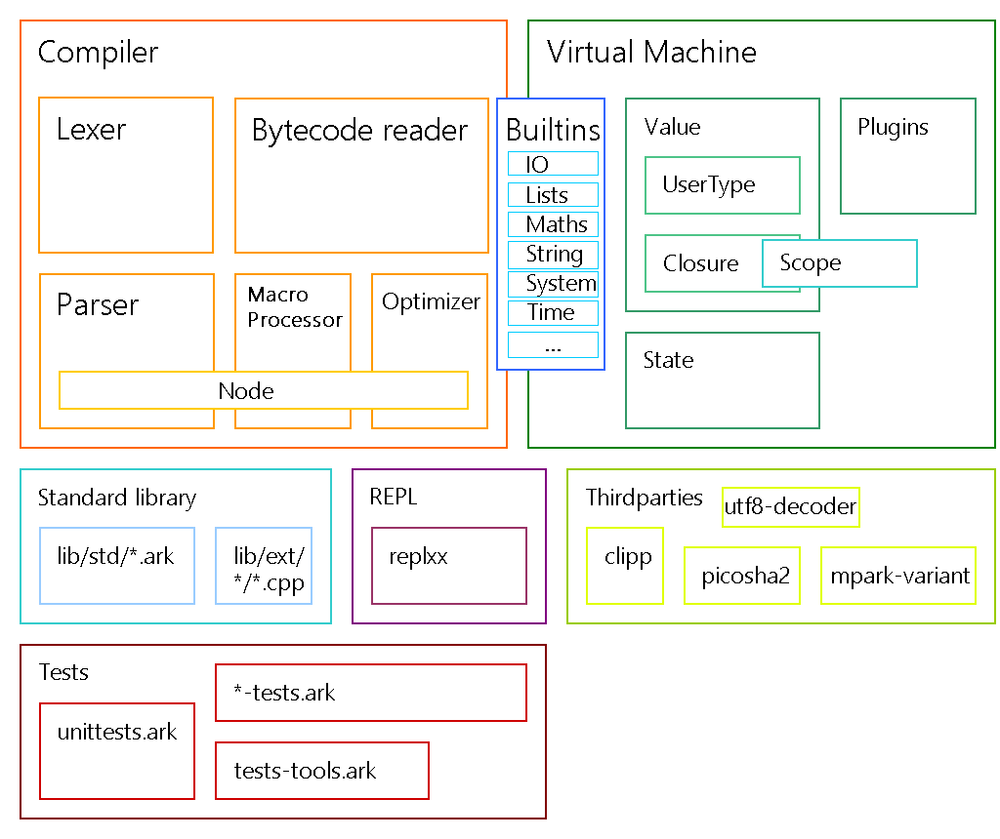

# ArkScript  

[](https://app.codacy.com/app/folaefolc/Ark?utm_source=github.com&utm_medium=referral&utm_content=SuperFola/Ark&utm_campaign=Badge_Grade_Settings)


* [Documentation](https://arkscript-lang.github.io/documentation.html)
* Discord server: [invite link](https://discord.gg/YT5yDwn), to discuss the specification of the language and receive help
* [Modules](https://github.com/ArkScript-lang/modules)

**Nota bene**: the project is referred as "Ark" and as "ArkScript". The official public name is "ArkScript" since "Ark" is already being used by [another language](https://github.com/ark-lang/ark)

## Key features

ArkScript is
* small: the compiler and the virtual machines fit under 8000 lines, but also small in terms of keywords (it has only 10)!
* a scripting language: it's very easy to embed it in your application. The builtin construction is quite easy to understand, so adding your own functions to the virtual machine is effortless
* portable: it produces a bytecode which is run by its virtual machine, like Java but without the `OutOfMemoryException`
* a functional language: every parameter is passed by value, everything is immutable unless you use `mut` to define a mutable variable
* powerful: it can handle object-oriented programming in a very elegant way with its closures and explicit captures (see examples/church-encoding)
* promoting functionalities before performances: expressiveness often brings more productivity, but performances aren't bad at all
* easy to compile: it takes less than 200ms to compile and check a complex code with a lot of branches and sub-branches of 200 lines.
* a Lisp-like, but with fewer parentheses: `[...]` is expanded to `(list ...)` and `{}` to `(begin ...)`. More shorthands will come in the future.
* extensible: it is very easy to create a C++ module to use in the language

Also it has:
* a REPL with autocompletion and coloration
* a growing standard library, composed of ArkScript (under `lib/std/`) and C++ (under `lib/ext/`)
* a lot of unit tests, which are ran before every release to ensure everything work as intended
* docker images:
    * [stable](https://hub.docker.com/r/arkscript/stable)
    * [nightly](https://hub.docker.com/r/arkscript/nightly)

## Examples

### Fibonacci suite

```clojure
(let fibo (fun (n)
    (if (< n 2)
        n
        (+ (fibo (- n 1)) (fibo (- n 2))))))

(print (fibo 28))  # display 317811
```

## More or less game

```clojure
# more or less game
(print "More or less game!")

(import "random.arkm")
(import "Math/Arithmetic.ark")

(let number (mod (abs (random)) 10000))
(print number)
(mut value 0)
(mut tries 0)

(mut continue true)

(while continue {
    (set value (toNumber (input "Input a numeric value: ")))

    (if (< value number)
        # then
        (print "More!")
        # else
        (if (= value number)
            # then
            { (print "Bingo!") (set continue false) }
            # else
            (print "Less!")))

    (set tries (+ 1 tries))})

(print "You won in" tries "tries")
```

More examples are available in the folder `examples/`.

## Installation

### Through the latest release

*Linux only*

**Important**: this method will add the folder where ArkScript will be downloaded to your path. The executable being named `ark` you can have **conflicts** with another existing program named `ark` as well, [a KDE archiving tool](https://linux.die.net/man/1/ark).

```bash
mkdir -p "${HOME}/.ark"
cd "${HOME}/.ark"
install_dir=`pwd`

current=`curl -s https://github.com/ArkScript-lang/Ark/releases/latest | egrep -o "tag/(?[^\"]+)" | cut -c 5- -`
url="https://github.com/ArkScript-lang/Ark/releases/download/$current/linux64.zip"
wget --quiet $url

if [ -f linux64.zip ]; then
    unzip -o linux64.zip
    rm linux64.zip
fi

# export arkscript path to your PATH variable to call it from everywhere
# export also ARKSCRIPT_PATH for arkscript to find its standard library
cat >> $HOME/.bashrc<< EOF
export PATH="$PATH:${install_dir}/"
export ARKSCRIPT_PATH="${install_dir}"
EOF
```

Finally, don't forget to `source $HOME/.bashrc` to refresh your path.

### Through docker

```bash
$ docker pull arkscript/stable:latest
```

### Through [werb](https://github.com/wafelack/werb)

*Linux only*

```bash
$ cargo install werb
$ werb install arkscript
```

## Contributing

* First, [fork](https://github.com/ArkScript-lang/Ark/fork) the repository
* Then, clone your fork: `git clone git@github.com:username/Ark.git`
* Create a branch for your feature: `git checkout -b feat-my-awesome-idea`
* When you're done, push it to your fork and submit a pull request!

Don't know what to work on? No worries, we have a [list of things to do](https://github.com/ArkScript-lang/Ark/projects) :wink:

### Our beloved contributors

Who worked on
* the standard library
    * [@SuperFola](https://github.com/SuperFola)
    * [@Natendrtfm](https://github.com/Natendrtfm)
    * [@rinz13r](https://github.com/rinz13r)
    * [@FrenchMasterSword](https://github.com/FrenchMasterSword)
    * [@rstefanic](https://github.com/rstefanic)
    * [@PierrePharel](https://github.com/PierrePharel)
    * [@Wafelack](https://github.com/Wafelack)
* the builtins
    * [@SuperFola](https://github.com/SuperFola)
    * [@rinz13r](https://github.com/rinz13r)
    * [@PierrePharel](https://github.com/PierrePharel)
* the REPL
    * [@rstefanic](https://github.com/rstefanic)
    * [@PierrePharel](https://github.com/PierrePharel)
* the CLI
    * [@SuperFola](https://github.com/SuperFola)
    * [@DontBelieveMe](https://github.com/DontBelieveMe)
    * [@PierrePharel](https://github.com/PierrePharel)
* the documentation
    * [@SuperFola](https://github.com/SuperFola)
    * [@OfficePop](https://github.com/OfficePop)
    * [@PierrePharel](https://github.com/PierrePharel)
* the language specification
    * [@SuperFola](https://github.com/SuperFola)
    * [@FrenchMasterSword](https://github.com/FrenchMasterSword)
    * [@PierrePharel](https://github.com/PierrePharel)
* the logo
    * [@mazzdevs](https://github.com/mazzlabs)
* the docker integration
    * [@yardenshoham](https://github.com/yardenshoham)

### Contributing to the ArkScript standard library

See [Coding guidelines](https://github.com/ArkScript-lang/Ark/wiki/Coding-guidelines#coding-in-ark) if you want to write ArkScript for the library (see folder `lib/std/`).

For performance reasons, some functions might be written in C++, in `include/Ark/Builtins/Builtins.hpp` and `src/Builtins/`.

### Code structure



## Building

### Dependencies

* C++17
* CMake >= 3.12
* Visual Studio >= 11 (on Windows)
* On macOS versions prior to 10.15, `libc++` lacks `filesystem` in the standard library.
    * Install a newer compiler using [Homebrew](https://docs.brew.sh/): `brew install gcc && brew link gcc`
    * Pass compiler path to `cmake` in the build step: `-DCMAKE_CXX_COMPILER=/usr/local/bin/g++-9`

Some libs already included in [thirdparties](https://github.com/ArkScript-lang/thirdparties).

### Through CMake

Different CMake switches are available to customize the build:
* `-DARK_BUILD_EXE` to generate an executable, defaults to Off, building a shared library only
* `-DARK_ENABLE_SYSTEM` to enable `sys:exec` (execute shell commands without restrictions), defaults to On
* `-DARK_PROFILER` to enable the [coz](https://github.com/plasma-umass/coz) profiler, defaults to Off
* `-DARK_PROFILER_COUNT` to count every creation/copy/move of the internal value type, defaults to Off
* `-DARK_SCOPE_DICHOTOMY` to activate the dichotomic mode of the scope, defaults to Off

```bash
# first, clone it
~$ git clone --depth=50 --branch=dev https://github.com/ArkScript-lang/Ark.git
~/Ark$ cd Ark
~/Ark$ git submodule update --init --recursive
# building Ark
~/Ark$ cmake . -Bbuild -DCMAKE_BUILD_TYPE=Release -DARK_BUILD_EXE=On
~/Ark$ cmake --build build --config Release
# installing Ark (might need administrative privileges)
~/Ark$ cmake --install build --config Release
# running
~/Ark$ ark --help
DESCRIPTION
        ArkScript programming language

SYNOPSIS
        ark -h
        ark -v
        ark --dev-info
        ark -e <expression>
        ark -c <file> [-d]
        ark -bcr <file>
        ark <file> [-d] [-L <lib_dir>] [-f(fac|no-fac)] [-f(ruv|no-ruv)]

OPTIONS
        -h, --help                  Display this message
        -v, --version               Display ArkScript version and exit
        --dev-info                  Display development information and exit
        -e, --eval                  Evaluate ArkScript expression
        -c, --compile               Compile the given program to bytecode, but do not run
        -d, --debug...              Increase debug level (default: 0)
        -bcr, --bytecode-reader     Launch the bytecode reader
        -L, --lib                   Set the location of the ArkScript standard library   
        -f(fac|no-fac)              Toggle function arity checks (default: ON)
        -f(ruv|no-ruv)              Remove unused variables (default: ON)

LICENSE
        Mozilla Public License 2.0
```

## Performances

See https://github.com/ArkScript-lang/benchmarks

## Games

You can find a snake created in ArkScript in the folder examples/games/snake (run it from there, otherwise it won't find the font and the sprites ; you won't need to install the SFML).


Controls are the arrows (left, right, up and down), the game closes itself when you successfully collect the 3 apples.

## The donators

Huge thanks to those people for their donations to support the project:
* [TheCountVEVO](https://github.com/TheCountVEVO)
* [llexto](https://github.com/llexto)

## Credits

This project was inspired by [gameprogramingpatterns](http://gameprogrammingpatterns.com/bytecode.html) and [ofan lisp.cpp](https://gist.github.com/ofan/721464)

## Copyright and Licence information

Copyright (c) 2019-2021 Alexandre Plateau. All rights reserved.

This ArkScript distribution contains no GNU GPL code, which means it can be used in proprietary projects.
