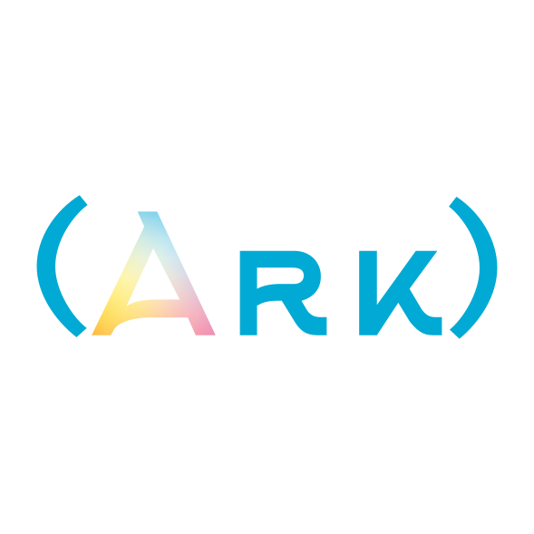
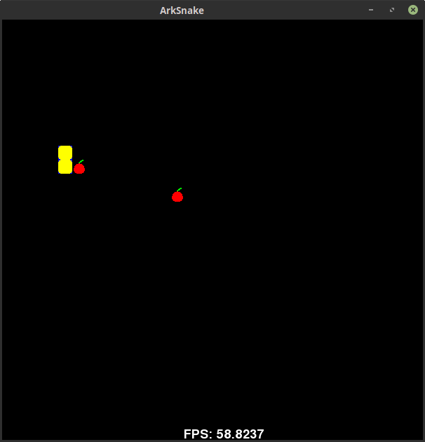

# ArkScript  




* [Documentation](https://arkscript-lang.dev/documentation.html)
* Discord server: [invite link](https://discord.gg/YT5yDwn), to discuss the specification of the language and receive help
* [Modules](https://github.com/ArkScript-lang/modules)

**Nota bene**: the project is referred as "Ark" and as "ArkScript". The official public name is "ArkScript" since "Ark" is already being used by [another language](https://github.com/ark-lang/ark)

## Key features

ArkScript is
* **small**: the core fit under 8000 lines of code ; also small in terms of keywords (only 10)
* **a scripting language**: very easy to embed it in your projects. Registering your own functions in the language is made easy
* **portable**: a unique bytecode which can be run everywhere the virtual machine is
* **a functional language**: every parameter is passed by value, everything is immutable unless specified
* **powerful**: provides closures and explicit capture
* **promoting functionalities before performances**: expressiveness often brings more productivity, though performances aren't left behind
* **a Lisp inspired language**, with fewer parentheses: `[...]` is expanded to `(list ...)` and `{}` to `(begin ...)`
* **extensible**: supports C++ module to use it in the language, adding functionalities

Also it has:
* **macros**: if/else, values, and functions
* tail call optimization
* a REPL with autocompletion and coloration
* a growing standard library, composed of ArkScript code (under `lib/std/`) and C++ (under `lib/ext/`)
* a lot of unit tests (but never enough), which are ran before every release to ensure everything works as expected
* docker images:
    * [stable](https://hub.docker.com/r/arkscript/stable), built after each release
    * [nightly](https://hub.docker.com/r/arkscript/nightly), built after each commit

## Examples

### Fibonacci suite

```clojure
(let fibo (fun (n)
    (if (< n 2)
        n
        (+ (fibo (- n 1)) (fibo (- n 2))))))

(print (fibo 28))  # display 317811
```

## More or less game

```clojure
(import "random.arkm")
(import "Math.ark")

(let number (mod (math:abs (random)) 10000))

(let game (fun () {
    (let impl (fun (tries) {
        (let guess (toNumber (input "Input a numeric value: ")))

        (if (< guess number) {
            (print "It's more than " guess)
            (impl (+ tries 1))
        }
            (if (= guess number) {
                (print "You found it!")
                tries
            } {
                (print "It's less than " guess)
                (impl (+ tries 1))
            }))
    }))

    (let tries (impl 0))
    (print "You won in " tries " tries.")
}))

(game)

```

More examples are available inside `examples/`.

## Installation

You can either use docker:

```bash
docker pull arkscript/stable:latest

# or use the most updated repo
docker pull arkscript/nightly:latest
```

or [build the project with CMake](#building) and install it with CMake:

```bash
cmake --install build
```

## Contributing

* First, [fork](https://github.com/ArkScript-lang/Ark/fork) the repository
* Then, clone your fork: `git clone git@github.com:username/Ark.git`
* Create a branch for your feature: `git checkout -b feat-my-awesome-idea`
* When you're done, push it to your fork and submit a pull request

Make sure you follow the [contribution guidelines](CONTRIBUTING.md) before submitting your pull request!

Don't know what to work on? No worries, we have a [list of things to do](https://github.com/ArkScript-lang/Ark/issues) :wink:

### Related projects

We have other projects tightly related to ArkScript, which aren't necessarily C++ oriented:
* the [Request For Comments](https://github.com/ArkScript-lang/rfc), where we discuss new features for the language
* the [standard library](https://github.com/ArkScript-lang/std), written in ArkScript itself
* the [standard library modules](https://github.com/ArkScript-lang/modules), extending the capacities of the language, written in C++
* [ArkDoc](https://github.com/ArkScript-lang/ArkDoc), a documentation generator *à la doxygen* for ArkScript, written in Python 3
* our [website](https://github.com/ArkScript-lang/arkscript-lang.github.io) written in HTML, CSS and JavaScript

### Our beloved contributors

[Full list here](https://github.com/ArkScript-lang/Ark/graphs/contributors).

### Coding guidelines for contributing

See [C++ Coding guidelines](https://github.com/ArkScript-lang/Ark/blob/dev/CONTRIBUTING.md#c-coding-guidelines) if you want to contribute to ArkScript compiler / runtime.

Also, see [ArkScript Coding guidelines](https://github.com/ArkScript-lang/rfc/blob/master/001-coding-guidelines.md) for other files, written in ArkScript.

For performance reasons, some functions might be written in C++, in `include/Ark/Builtins/Builtins.hpp` and `src/Builtins/`.

### Code structure


## Building

### Dependencies

* C++17
* CMake >= 3.12
* Visual Studio >= 11 (on Windows)
* On macOS versions prior to 10.15, `libc++` lacks `filesystem` in the standard library.
    * Install a newer compiler using [Homebrew](https://docs.brew.sh/): `brew install gcc && brew link gcc`
    * Pass compiler path to `cmake` in the build step: `-DCMAKE_CXX_COMPILER=/usr/local/bin/g++-9`

All the external libraries we use are already included in [thirdparties](https://github.com/ArkScript-lang/thirdparties).

### Through CMake

Different CMake switches are available to customize the build:
* `-DARK_BUILD_EXE` to generate an executable, defaults to Off, building a shared library only
* `-DARK_ENABLE_SYSTEM` to enable `sys:exec` (execute shell commands without restrictions), defaults to On
* `-DARK_PROFILER` to enable the [coz](https://github.com/plasma-umass/coz) profiler, defaults to Off
* `-DARK_PROFILER_COUNT` to count every creation/copy/move of the internal value type, defaults to Off
* `-DARK_PROFILER_MIPS` to enable the MIPS counting, defaults to Off
* `-DARK_NO_STDLIB` to avoid the installation of the ArkScript standard library
* `-DARK_BUILD_MODULES` to trigger the modules build
* `-DARK_SANITIZERS` to enable ASAN and UBSAN

```bash
# first, clone it
git clone --depth=50 --branch=dev https://github.com/ArkScript-lang/Ark.git
cd Ark
git submodule update --init --recursive
# building Ark
cmake . -Bbuild -DCMAKE_BUILD_TYPE=Release -DARK_BUILD_EXE=On
cmake --build build --config Release
# installing Ark (might need administrative privileges)
cmake --install build --config Release
```

Desired output of `arkscript --help`:
```bash
DESCRIPTION
        ArkScript programming language

SYNOPSIS
        arkscript -h
        arkscript -v
        arkscript --dev-info
        arkscript -e <expression>
        arkscript -c <file> [-d]
        arkscript -bcr <file> -on
        arkscript -bcr <file> [-(a|st|vt)] [-s <start> <end>]
        arkscript -bcr <file> [-cs] [-p <page>]
        arkscript <file> [-d] [-L <lib_dir>]

OPTIONS
        -h, --help                  Display this message
        -v, --version               Display ArkScript version and exit
        --dev-info                  Display development information and exit
        -e, --eval                  Evaluate ArkScript expression
        -c, --compile               Compile the given program to bytecode, but do not run
        -d, --debug...              Increase debug level (default: 0)
        -bcr, --bytecode-reader     Launch the bytecode reader
        -on, --only-names           Display only the bytecode segments names and sizes
        -a, --all                   Display all the bytecode segments (default)
        -st, --symbols              Display only the symbols table
        -vt, --values               Display only the values table
        -s, --slice                 Select a slice of instructions in the bytecode
        -cs, --code                 Display only the code segments
        -p, --page                  Set the bytecode reader code segment to display
        -L, --lib                   Set the location of the ArkScript standard library. Paths can be
                                    delimited by ';'

LICENSE
        Mozilla Public License 2.0
```

### In your own project

Please refer to the [embedding ArkScript](https://arkscript-lang.dev/impl/d7/dea/tutorial_embedding.html) tutorial.

## Performances

See https://github.com/ArkScript-lang/benchmarks

## Games

You can find a snake created in ArkScript in the folder examples/games/snake (run it from there, otherwise it won't find the font and the sprites ; you won't need to install the SFML).



Controls are the arrows (left, right, up and down), the game closes itself when you successfully collect the 3 apples.

## The donators

Huge thanks to those people for their donations to support the project:
* [TheCountVEVO](https://github.com/TheCountVEVO)
* [llexto](https://github.com/llexto)
* COUR Eloïse
* [AKPINAR Dylan](https://github.com/DylanAkp)
* [Ryan C. Gordon](https://icculus.org) through his [2022 Microgrant](https://twitter.com/icculus/status/1534552918317318144)

## Credits

This project was inspired by [gameprogramingpatterns](http://gameprogrammingpatterns.com/bytecode.html) and [ofan lisp.cpp](https://gist.github.com/ofan/721464)

## Copyright and Licence information

Copyright (c) 2019-2021 Alexandre Plateau. All rights reserved.

This ArkScript distribution contains no GNU GPL code, which means it can be used in proprietary projects.
